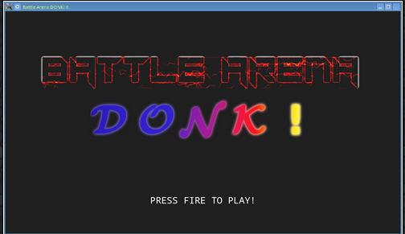
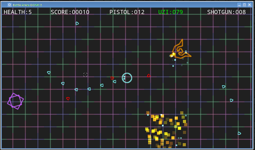

#  Battle Arena Donk!

## Introduction

The Shooter Game `Battle Arena Donk!` is a simple SDL-based game that allows the player(i.e. `Donk`) to shoot enemies and gain points. Powerups such as health powerups and bullet powerups are randomly provided after killing each enemy. And upon one round of the game, the player has the option to records his/her score in the game achievement table. However, scores will not be stored in non-volatile storage, so each time the player closes the game, all scores will be removed.

## User Manual

 The player starts the game by clicking the left-button of the mouse:

The player can play the game in the following way:

- Movement: use the key `WASD` to move the character `donk`
- Weapon: click the left button of the mouse to fire bullets. The player can switch weapons between the pistol and Uzis by scrolling the button wheel:
    - scrolling up will choose the Uzis
    - scrolling down will choose the pistol
- Bullet: when the player is using the pistol, one can click the right button of the mouse to refill the pistol. Player is not able to refill
the Uzis unless capturing the bullet powerups.

As enemies are shooting towards the player, the player should try to avoid enemies' bullets and shoot enemies.

By default the player has 5 lives, and one round will end until the player is dead. Upon each round, a new round will happen so that the player can continue playing the game.

## Program Installation and Compilation

1.The program requires the local machine to support cmake. Provided the player is running on a linux machine, please install cmake via:

    sudo apt-get install -y cmake

2.The program requires at least `g++8` and the support of `c++17` feature of `gcc`. One can upgrade the existing gcc via:

    sudo apt install -y gcc-8 g++-8

And rebuild the symbolic link for /usr/bin/gcc and /usr/bin/g++ by the following command lines:

    sudo rm /usr/bin/gcc
    sudo ln -s /usr/bin/gcc-8 /usr/bin/gcc

    sudo rm /usr/bin/g++
    sudo ln -s /usr/bin/g++-8 /usr/bin/g++

3.Install aclocal-1.16 via the following commands:

    sudo apt-get update
    sudo apt-get install -y automake

3.The program requires libraries `SDL` and `SDL2_image` to support the animation. Fortunately, the repository includes the source code of both libraries. Player needs to manually install these two libraries to one's local machine with the following generic command line before building the program:

-For SDL library:

    cd SDL/
    ./autogen.sh
    cd build
    ../configure
    make
    sudo make install

-For SDL2_image library:

    cd SDL2_image
    ./autogen.sh
    cd build
    ../configure
    make
    sudo make install

4.Go to the game directory and do the following to build the program:

    rm -r build
    mkdir build 
    cd build
    cmake ..
    make

Please note that the program uses `CMakeLists.txt` to generate corresponding `Makefile`. 

Then player can start the game by the following commands:

    cd build
    ./ShooterGame

## Project Criteria Evaluation

### Loops, Functions, I/O

__Criteria #1__: *The project demonstrates an understanding of C++ functions and control structures*.

The program is designed in modulized manner in a sense that C++ functions are heavily used to achieve one particular task. Some functions are member functions of classes, some are class methods accessible everywhere.

As for control structures, from `main.cpp` we can see a simple state machine built with `while` loop and conditional statements to direct the program flow. Moreover, we can see more such state machines in `begin()`, `run()` and `endWithRecord()` implemented in `game.cpp`.

__Criteria #2__: *The project reads data from a file and process the data, or the program writes data to a file*.

Throughout the project, I/O functions are used to load `.png` images to the program via `IMG_LoadTexture()`. For example, in line 8 of `title.cpp`, `Title::Title(SDL_Renderer *sdl_renderer)` calls `Title::Title(SDL_Renderer *sdl_renderer)`, which calls `IMG_LoadTexture()` to load images like `battleArena.png` and `D.png` and convert them into `SDL_Texture` instances. 

__Criteria #3__: *The project accepts user input and processes the input*.

In `player.cpp`, function `void handleInput()` is used to accept user inputs via a mouse to control the player to move, to fire bullets, or input the user name to the game achievement table.

### Object Oriented Programming

__Criteria #1__: *The project uses Object Oriented Programming techniques*.

As one can seen obviously, the project is organized into multiple classes with different class attributes and class methods.

__Criteria #2__: *Classes use appropriate access specifiers for class members*.

Under the program, each data or function of any class is equipped with a access specifier. Majority class definitions use `public` access specifiers for both member functions and member data, such as `Effect` class. Classes like `Game` and `Renderer` uses both `public` and `private` access specifiers to hold data and functions. 

__Criteria #3__: *Class constructors utilize member intiailization lists*.

Initialization lists are used in all classes with speicifc data initialization taking place in the constructor body. For instance, class constructor `Entity::Entity(float x, float y, int angle, int side)` uses the initialization list to initialize member data `x`,`y`,`angle`,`side`. 

__Criteria #4__: *Classes abstract implementation details from their interfaces.*

All function names are designed to be self-explainable. While some functions are complex enough to perform multiple tasks, necessary comments are provided to ease understanding. For instance, `void Game::addHighscore(int score)` is explainable enough to tell the user that such function will add the new score named `score` to an internal vector storing game scores. The comments inside the function allows the user to understand that the internal score vector is sorted in the descending order each time a new score item is inserted into the vector.

__Criteria #5__: *Classes encapsulate behavious*.

Under the program, all data and functions are grouped based on their functionality. For instance, functions regarding rendering are grouped together in class `Renderer`; functions and various data structures managing the workflow of the game are grouped into class `Game`. 
Member data is set as `public` for those that are not subject to an invariant. For instance, all data members in class `Entity` are set as public data as no invariant exists for all of them. Similar to class `Effect`.

__Criteria #5__: *Classes follow an appropriate inheritance hierarchy*.

Under the program, class inheritance hirarchy is achieved by designing classes in the mindset of feature extension. For instance, powerup classes are designed in the following hirarchy:

    UziPowerup --> Powerup --> Entity
    HealthPowerup --> Powerup --> Entity

Class `Powerup` extends the features of class `Entity` by supplying member functions `tick()` and `touch()`, which is a virtual function to be defined in its derived classes.

Class `UziPowerup` and `HealthPowerup` are derived from `Powerup` in public inheritance to specify the behaviour of `tick()` and `touch()`. 

__Criteria #6__: *Overloaded functions allow the same function to operate on different parameters*.

In class `Highscore`, the `rule of five` is implemented. Therefore, `=` operator is overloaded so that copy assignment operator and move assignment operator is available for `Highscore` class.

__Criteria #7__: *Derived class functions override virtual base class functions*.

In `poweup.cpp`, class `HealthPowerup` and `UziPowerup` override virtual functuion `touch()`.

__Criteria #8__: *Templates generalize functions in the project*.

In `game.cpp`, from line `37` to `72`, the following template functions are defined to remove duplicates of function implementations:

    //define a function template for touching others entities
    template <typename T> void touchOthers(T *source);
    //define a function template for updating powerup objects
    template<typename T> void updatePowerups(T &powerups);
    //define a function template for drawing items
    template<typename T> void drawItems(T &list);

### Memory Management 

__Criteria #1__: *The project makes use of references in function declarations*

In `game.h`, the following functions took advantage of pass-by-reference method:

    void gameFlowWithPlayer(long &then, float &remainder); 
    void gameFlowWithoutPlayer(long &then, float &remainder);
    void capFrameRate(long &then, float &remainder);

__Criteria #2__: *The project uses destructors appropriately*.

Under the program, not only each class has a defined destructor, but also each destructor destroys the associated `SDL_Texture` instance or clears internal varaibles to free up resources. For example, in `game.cpp`, `~Game()` clear all internal vectors; in `Title::~Title()`, all ` *` data are destroyed via `SDL_DestroyTexture()`.

__Criteria #3__: *The project uses scope/Resource Acquisition Is Initialization (RAII) where appropriate*.

Altough no explicit `new()/delete()` used in all class definitions, all classes are designed with the RAII mindset. For instance, since nearly all classes require allocating and initializing `SDL_Texture *` data, `SDL_Texture *` member data is automatically allocated and initialized in class constructors and is automatically destroyed in the corresponding class destructors. For instance, constructors and destructors for class `Bullet`,`Effect` and `Player` are designed to initialize and destroy `SDL_Texture *` data automatically.

__Criteria #4__: *The project follows the Rule of 5*.

The rule of five is supplied to class `Highscore` with the following memaber functions:

    Highscore();
    ~Highscore();
    Highscore(Highscore const &source);
    Highscore(Highscore &&source);
    Highscore &operator=(Highscore const &source);
    Highscore &operator=(Highscore &&source);

__Criteria #5__: *The project uses move semantics, to move data, instead of copying it, where possible*.

The program heavily uses smart pointers especially smart pointers, so move semantics are used almost everywhere. For instance, the move semantics is used in initializating `std::unique_ptr<Game>` variable in `main.cpp`:

    std::unique_ptr<Player> player = std::make_unique<Player>(sdl_renderer);
    renderer = std::make_unique<Renderer>(sdl_window, sdl_renderer);
    game = std::make_unique<Game>(sdl_renderer, std::move(renderer), std::move(player));

Also in `game.cpp`, the class `Game` constructor uses the move semantics to assign argument to internal data members:

    Game::Game(SDL_Renderer *sdl_renderer, std::unique_ptr<Renderer> renderer, std::unique_ptr<Player> player):
    _sdl_renderer(sdl_renderer), _player(std::move(player)),_renderer(std::move(renderer)){

        ...
        for(int i=0;i<(NUM_HIGHSCORES + 1);i++)
            _high_scores.emplace_back(std::move(Highscore()));
    }

__Criteria #6__: *The project uses smart pointers instead of raw pointers*.

The use of smart pointers can be observed mainly in `main.cpp` and `game.h`. In `game.h`, all vectors stores `std::unique_ptr` instances and pointers of custom classes are `std::unique_ptr` instances:

    class Game {
        ...
        private:
            std::vector<std::unique_ptr<Bullet>> _bullets;
            std::vector<std::unique_ptr<UziPowerup>> _uzi_powerups;
            std::vector<std::unique_ptr<HealthPowerup>> _health_powerups;
            std::vector<std::unique_ptr<Enemy>> _enemies;
            std::vector<std::unique_ptr<Effect>> _effects;
            std::vector<Highscore> _high_scores;
            std::unique_ptr<Renderer> _renderer;
            ...
            std::unique_ptr<Player> _player; 
            std::unique_ptr<Title> _title;
        ...
    }

In `main.cpp`, we have major program variables defined as `std::unique_ptr` instances:

    ...
    std::unique_ptr<Renderer> renderer;
    std::unique_ptr<Game> game;
    ...
    std::unique_ptr<Player> player = std::make_unique<Player>(sdl_renderer);
    renderer = std::make_unique<Renderer>(sdl_window, sdl_renderer);
    game = std::make_unique<Game>(sdl_renderer, std::move(renderer), std::move(player));
    ...

